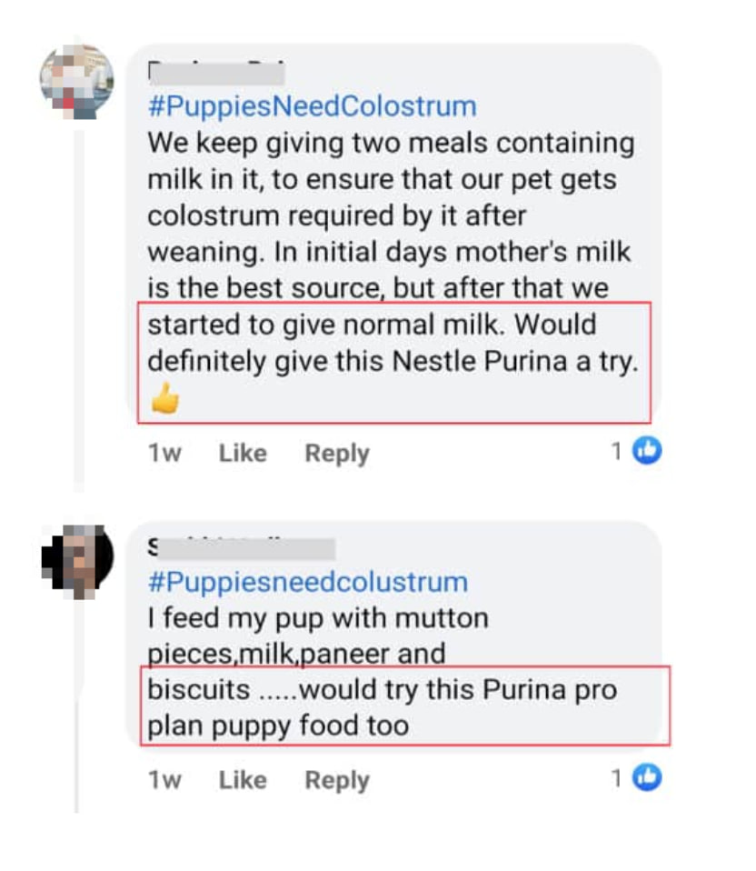

### Topics we will cover in this seo class
- What is SEO and why is it important?
- How do search engines work? (Google bots, crawling, indexing, ranking)
- Types of SEO:
- On-Page SEO (Optimizing content, titles, URLs)
- Off-Page SEO (Backlinks, social signals, influencer outreach)
- Technical SEO (Site speed, mobile-friendliness, structured data)
- Keyword Research & Content Creation
- SEO Tools: Google Analytics, Google Search Console, Keywords research tool


--------
# Introduction of SEO & Its Importance

## **What is SEO?** 

SEO (Search Engine Optimization) is the process of improving a website's visibility on search engines like Google, Bing, and Yahoo to attract more organic (non-paid) traffic. It involves optimizing content, structure, and technical aspects of a website to rank higher in search results.


## **Purpose of SEO**
The primary purpose of SEO is to help websites rank higher in search results and attract relevant users looking for specific products, services, or information.


## **Why is SEO Important in Digital Marketing?**
SEO (Search Engine Optimization) is a key pillar of digital marketing because it helps websites rank higher in search results, bringing in more traffic and potential customers. Without SEO, even the best websites can remain invisible to users.


## **Benefits of SEO**
- Increases Organic Traffic (More Visitors Without Paying for Ads)
- SEO helps websites **rank higher on Google**, making it easier for users to find them. 
- The higher a website appears in **search results**, the **more clicks** it gets


## **Boosts Online Visibility & Brand Awareness**
- SEO ensures that your website appears when people **search for products, services, or information** related to your business.
- Ranking for relevant keywords helps brands **stay top-of-mind** for potential customers.


## **Builds Credibility & Trust**
- Websites on **Google's first page** are perceived as **more reliable and trustworthy.**

```Example: People trust a #1 ranked doctor's website more than one on page 5 of Google```

- SEO helps improve site **security, user experience, and valuable content**, increasing credibility. 


## **Cost-Effective & Long-Term Growth**
- Unlike paid ads (PPC), SEO is a **long-term investment** that keeps generating traffic.
- Once your site ranks well, **it continues to attract visitors for free.**


# **Types of SEO:  On-Page, Off-Page, and Technical SEO**
SEO is divided into three main categories: **On-Page SEO, Off-Page SEO, and Technical SEO**. Each type plays a crucial role in improving a website's ranking and visibility on search engines.

## **1. On-Page SEO (Optimizing Website Content & Structure)**
On-Page SEO focuses on optimizing individual pages of a website to **make them more relevant and user-friendly** for both search engines and visitors.

### Key On-Page SEO Factors:
**Keyword Optimization** - Keywords are essential in content creation because they **help search engines and users understand what your content is about.**


**Meta Titles & Descriptions** - Meta titles and descriptions are essential for SEO and user engagement because they serve as the first impression of your content in search results.


**Header Tags (H1, H2, H3, etc.)** - Header tags play a crucial role in SEO, readability, and user experience by organizing content into a clear structure. 


**URL Structure** - URL improves SEO, enhances user experience. Search engines and users both rely on URLs to understand a page's content.


**Internal Linking** - Internal linking is important for SEO and user experience because it helps connect related pages within a website.

    https://thenike.online/


**Image Optimization** - Including images in content is essential as they grab attention, enhance understanding, and make the content more engaging.


**Content Quality** - A Quality content is important because is encourages people to engage with your content. It also helps improve SEO, making your content easier to find online.

- Example: A blog post titled "Best Running Shoes for Beginners" optimized with keywords, headings, and internal links will rank higher.

## **2. Off-Page SEO (Building Website Authority & Trust)**
Off-Page SEO involves actions taken outside your website to improve its authority, trust, and reputation.

### Key Off-Page SEO Strategies:
**Backlinks (Link Building)** - Signaling to search engines that your content is valuable and trustworthy.


**Social Media Signals** - Search engines consider these signals as a measure of trust and relevance, which can positively impact your rankings.


**Guest Post**- Guest posts are articles or content written by someone and published on another website or blog to build backlinks.

**Influencer Outreach** - It's crucial because influencers have loyal audiences that trust their recommendations.

**Brand Mentions** - When other websites or individuals mention your brand, it signals to search engines that your brand is relevant and trusted.




## **3.Technical SEO (Optimizing Website Performance & Structure)**
Technical SEO focuses on the backend of the website, ensuring it is easily crawlable and indexable by search engines.

### Key Technical SEO Elements:
**Website Speed Optimization** - Its important because it directly impacts user experience and search engine rankings. 

**Mobile-Friendliness** - It is crucial because it ensures that your website provides a seamless experience for users on mobile devices.

**Secure Website (HTTPS)** - This makes people feel safe and confident when using your site. It also helps prevent hackers from stealing data. Plus, search engines like Google trust secure sites more and rank them higher.

**XML Sitemap** - ​​XML sitemap is important in technical SEO because it acts like a map for search engines, helping them find and index all the pages on your website. 

**Structured Data (Schema Markup)** - It helps search engines better understand your website's content. By adding structured data, you can provide specific details about your content, such as products, reviews, events, or articles.


**Fixing Broken Links & Errors** - Errors, such as 404 pages or server issues, can signal to search engines that your site isn't well-maintained, which can lower your rankings.

    https://thenike.online/which-celebrities-wear-nb-lifestyle-sneakers/


## Summary: How These Three SEO Types Work Together

| SEO Type      | Focus                                 | Key Strategies                                            |
| ----------- |---------------------------------------|-----------------------------------------------------------|
| `On-Page SEO`       | Optimizing website content & structure | Keywords, meta tags, internal links, high-quality content |
| `Off-Page SEO`       | Building authority & trust            | Backlinks, social media, guest post, brand mentions       |
| `Technical SEO`    | Improving site performance              | Page speed, mobile optimization, security, crawlability   |


**How SEO Helps Businesses Grow – Real-Life Examples**

SEO is a powerful digital marketing strategy that helps businesses increase visibility, attract customers, and boost revenue. By optimizing their websites for search engines, businesses can rank higher on Google and get free, targeted traffic.


Example:
E-commerce Store: A small online clothing store optimized its product pages for keywords like "best summer dresses 2024" and saw a 40% increase in organic traffic, leading to more sales.

Example:
Financial Consulting Firm: A financial company started blogging about tax-saving tips and optimizing for search queries like "how to save taxes legally". Their website started ranking on Google, increasing client inquiries by 60%.


#### Activity for today
    https://docs.google.com/
    document/d/1bDLkMDx2c-bHjFXrlSDbOxMK2q6a-6ld7Vm20nfpqto/edit?tab=t.0

