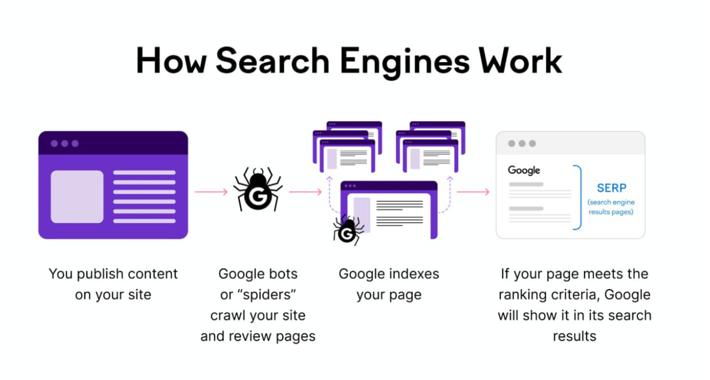
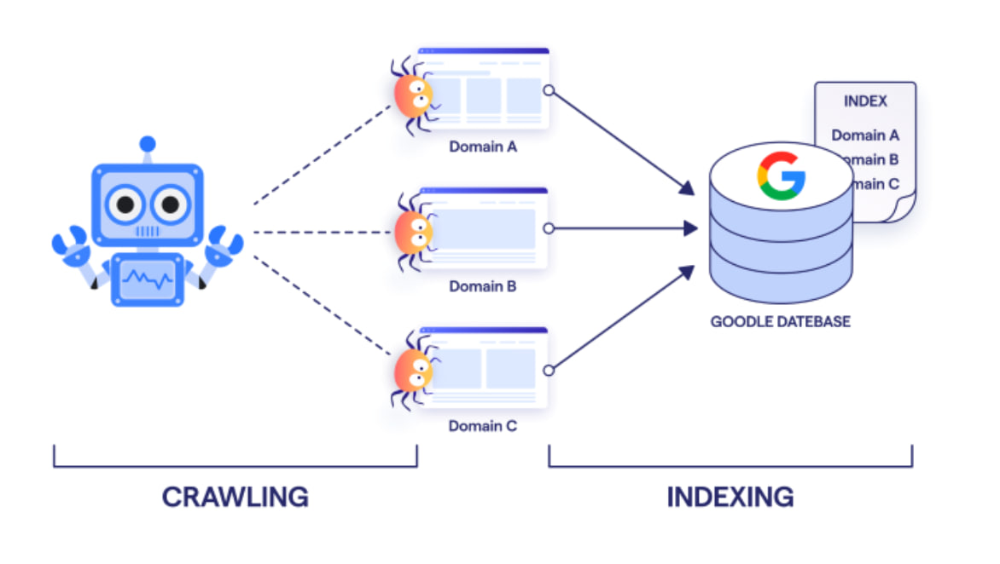
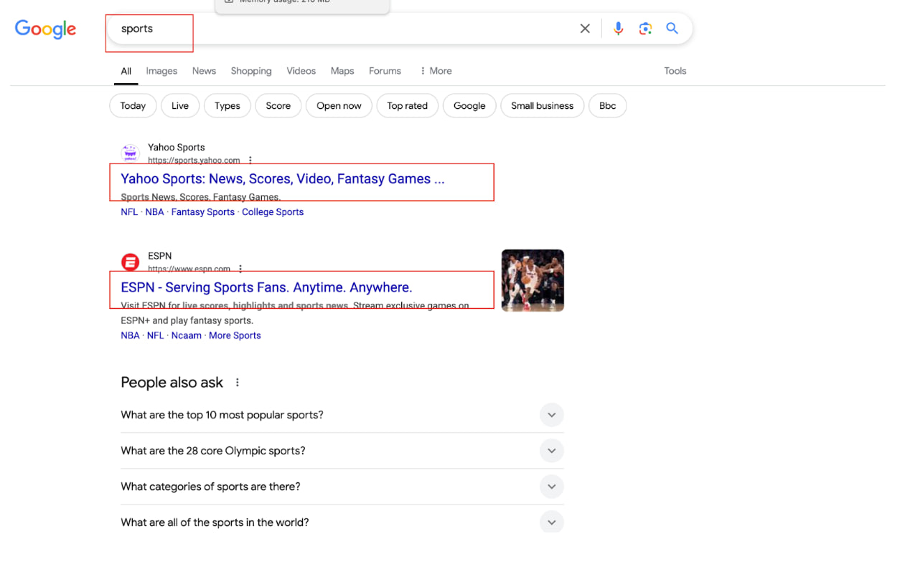
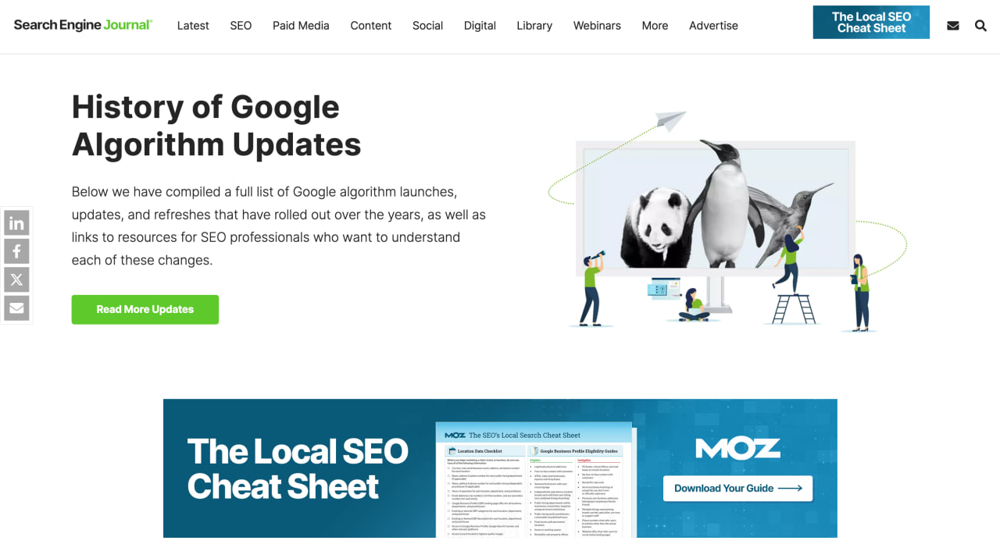

# **What is a Search Engine?**

Search engines like Google, Bing, and Yahoo help users find relevant information by analyzing and ranking web pages.

## **How Search Engines Work**



## **3 ways how search engine works:**

### **Crawling**

- Crawling is the process by which search engine bots or spiders scan your website's web pages to determine their content and relevance.
 
These bots follow links from one page to another, collecting information about websites.
Why is crawling important?

Crawling is essential because it enables search engines to understand your website's content and relevance. If a web page isn't crawled, it won't appear in search engine results pages, making it difficult for potential users to find you.


### **Indexing**
Indexing is the process where search engines like Google store and organize web pages after crawling them. Once a page is indexed it can appear in search engine result pages, The primary goal of indexing is to ensure that a website's content can appear in search results when users search for relevant keywords. If a page is not indexed, it won't appear in search results.



### **Ranking** 
"Ranking" is the process of arranging website links, items, people, or entities in a specific order based on a set of criteria, such as quality, performance, importance, or preference. It indicates relative positions, such as first, second, third, etc.

When a user searches for something, search engines rank the indexed pages based on relevance and quality. 



## **Google's algorithm considers 200+ ranking factors**

Google's algorithm is a set of rules that determines how to rank websites in search results. It's a complex system that uses many different algorithms, and it's constantly changing.

Keyword relevance – Does the page match the search query?
Backlinks – Are other websites linking to it?
Page speed & mobile-friendliness – Does it load fast and work on phones?
Freshness – Is the content recent and updated?

### Why its important?
Staying updated with Google's algorithm changes helps SEO professionals and website owners optimize content and avoid penalties, ensuring better rankings and visibility. 



## **Understanding User Intent in SEO**
User intent, also known as search intent, refers to the reason behind a user's search query. Understanding user intent is crucial for SEO because Google prioritizes pages that best match what users are looking for. It describes what the user wants to achieve from the search.

##### **There are four main types of user intent, each requiring a different SEO approach:**
- Informational Intent
- Commercial Intent
- Navigational Intent
- Transactional Intent


### **1. Informational Intent** 
**What It Means:**

- The user is looking for information, answers, or explanations.
- They are not ready to make a purchase but are researching a topic.

#### **Common Search Terms:**
- "How to lose weight fast"
- "What is blockchain technology?"
- "Best SEO practices for beginners"

#### **SEO Strategy:**
- Create high-quality blog posts, guides, and FAQs.
- Use clear headings and bullet points for easy reading.

```Example: If someone searches for "how to tie running shoes," a well-written blog post with step-by-step instructions and images would rank higher.```

### **2. Commercial Intent** 
**What It Means:**

- The user is comparing products or services before making a purchase decision.
- They are looking for reviews, comparisons, and recommendations.

#### **Common Search Terms:**
- "Best smartphones under $500"
- "Nike vs Adidas running shoes"
- "Top 10 web hosting services"

#### **SEO Strategy:**
 - Create comparison guides, reviews, and listicles.
 - Optimize for long-tail keywords (e.g., "best gaming laptops under $1000").
 - Include pros & cons, expert opinions, and customer reviews.


3. Navigational Intent 
**What It Means:**
- The user is searching for a specific brand, website, or product page.
- They already know what they want and just need to find the right page.

#### **Common Search Terms:**
- "Nike official website"
- "Facebook login"
- "Tesla Model 3 specs"

#### **SEO Strategy:**
- Optimize your brand name in titles, descriptions, and URLs.
- Ensure your homepage and key pages are indexed correctly.
- Use structured data (schema markup) to enhance brand visibility.

### **4. Transactional Intent**
**What It Means:**

- They are looking for product pages, services, or sign-up options.
- The user is ready to buy, subscribe, or take action.

#### **Common Search Terms:**
- "Buy iPhone 15 Pro online"
- "Best deal on MacBook Air"
- "Get free trial for Grammarly"

#### **SEO Strategy:**
- Optimize product pages with clear descriptions, images.
- Use keywords with commercial intent like "buy," "best price," or "discount."
- Improve site speed and mobile-friendliness for a smooth buying experience.


**: Checking Url if index in google, I provide list of Url and determine if "Indexed" or "Not Indexed"**


```
https://docs.google.com/document/d/1IMlndj_yQimzhtTgDBQG-XIHOoWZ1bj1zO-s5jw3eE4/edit?tab=t.0#heading=h.t2vzhkvig2w6
```
