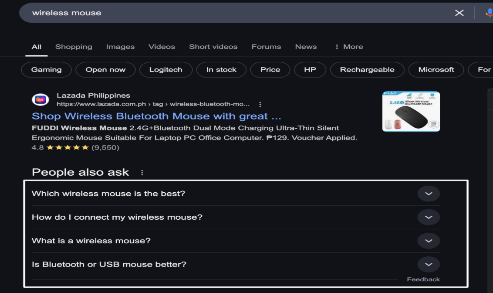
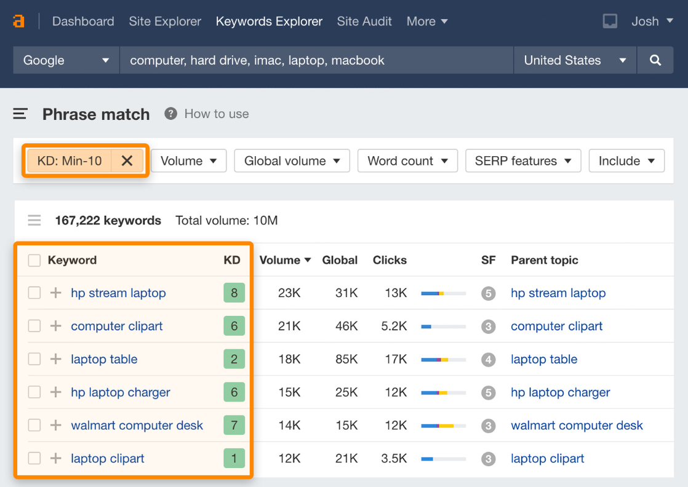

# Keyword Research & Its Importance

## **What Are Keywords?**
Keywords are words or phrases that people type into search engines to find information. They are the foundation of SEO, helping websites rank on search engines like Google.

### **Example Keywords**
- Short-Tail Keyword: "Shoes" (Broad, high competition)
- Long-Tail Keyword: "Best running shoes for beginners" (Specific, lower competition).

## **Role of Keywords in SEO**

### **Improve Search Engine Rankings**
Optimizing content with relevant keywords helps search engines **understand your website** and rank it for relevant searches.

### **Drive Targeted Traffic to Your Website**
Using the right keywords ensures that your website attracts **visitors who are  interested in your content or products.**

## **Short-Tail vs. Long-Tail Keywords – Pros & Cons**
Keywords are the backbone of SEO, and understanding the difference between short-tail and long-tail keywords can help you optimize your website for better rankings and conversions.

### **Short-Tail Keywords (Broad & High Volume)**

**Definition:** Short-tail keywords are **1-2 word phrases** that are broad and general.

**Example:** "Shoes," "SEO tips," "Digital marketing"

### **Pros of Short-Tail Keywords:**
**High Search Volume –** Attracts a large number of searches.

**More Visibility –** Appears in broad searches, reaching a wider audience.

**Competitive Advantage –** Ranking well can drive significant traffic.
### **Cons of Short-Tail Keywords:**

 **High Competition** – Harder to rank on Google's first page due to competition.

 **Low Conversion Rate** – Broad intent; users may not be ready to take action.

 **Costly for PPC Ads** – Expensive for Google Ads due to high competition.

## **Long-Tail Keywords (Specific & Intent-Based)**
**Definition:** Long-tail keywords are 3 or more words that are more specific and targeted.
**Example:** "Best running shoes for flat feet," "SEO tips for small businesses"

### **Pros of Long-Tail Keywords:**
 **Low Competition –** Easier to rank on Google.
 **Higher Conversion Rate** – Targets users with specific intent (buying, learning, etc.).
 **Better Audience Targeting** – Helps niche websites attract the right visitors.

### **Cons of Long-Tail Keywords:**
**Lower Search Volume** – Fewer people search for long-tail keywords.
**Takes Time to Research** – Requires proper keyword research to find effective long-tail terms.
 

## **How to Select the Right Keywords – Relevance, Search Volume, Competition**

Choosing the right keywords is essential for SEO success. The best keywords help your website rank higher, attract targeted traffic, and increase conversions. To find the right ones, focus on three key factors:

### **1. Relevance – Does the Keyword Match Your Content?**
Choose keywords that match your business, product, or content.
The keyword should align with user intent (what people are looking for).

**Example**:

- If you sell fitness equipment, a relevant keyword is "best home gym equipment" instead of just "equipment" (which is too broad).
- If you write a blog about SEO, "SEO tips for beginners" is better than just "SEO".

### **2. Search Volume – Are People Searching for This Keyword?**
Search volume tells you how many people look for a keyword every month.
Higher search volume = more traffic potential.
Avoid keywords with zero or very low searches (no one is searching for them).

 **Example**

- High Search Volume Keyword: "Best running shoes" (100,000+ searches/month)
- Low Search Volume Keyword: "Best pink and white running shoes with extra foam" (Too specific, fewer searches)

### **3. Competition – How Hard Is It to Rank?**
Some keywords are very competitive (big brands dominate).
Choose low or medium-competition keywords for better chances to rank.
Balance high and low competition keywords for a strong SEO strategy.

 **Example**

- High-Competition Keyword: "Best laptops" (Hard to rank because of big brands like Apple, Dell, HP)
- Low-Competition Keyword: "Best laptops for college students under $700" (Easier to rank because it's more specific).

## **How to Find the Best Keywords?**	

#### **Step 1: Brainstorm Keywords**
Think about what your customers search for.
Use Google Autocomplete & "People Also Ask" to find keyword ideas.

#### **Step 2: Check Search Volume & Competition**
- Use tools like Google Keyword Planner, Ahrefs, SEMrush, or Ubersuggest.
- Find a balance between high-volume + low-competition keywords.

#### **Step 3: Focus on User Intent**
- Informational Keywords: "How to lose weight" (People want information).
- Transactional Keywords: "Buy running shoes online" (People are ready to buy).

