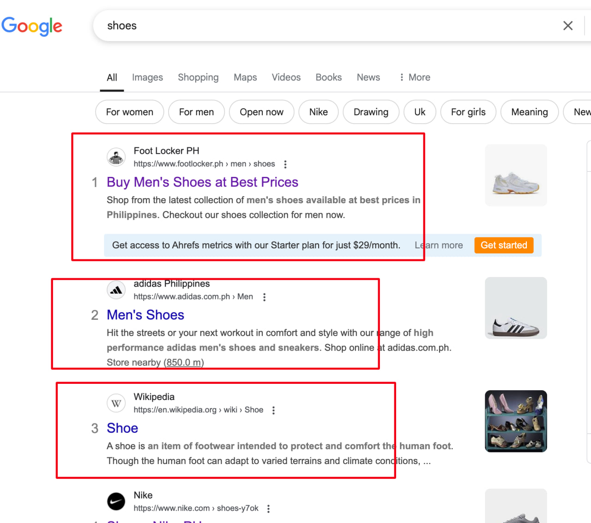

# Competitor Analysis & Keyword Strategy
## Competitor Analysis in SEO
Competitor analysis helps you understand what keywords, content, and strategies your competitors are using so you can improve your own SEO performance.

### **Step 1: Identify Your Competitors**

- Search your main keywords on Google and note the top-ranking websites.
- Use tools like Ahrefs, SEMrush, or Ubersuggest to find your SEO competitors.




**Example**

If you run an online shoe store, your competitors might be Nike, Adidas, Zappos, or local shoe retailers ranking for similar keywords.

### **Step 2: Analyze Competitor Keywords**

Find the keywords your competitors rank for and identify gaps & opportunities.

 Use Ahrefs, SEMrush, or Moz to analyze:

* Top-performing keywords
* Long-tail vs. short-tail keywords
* Keyword difficulty & search volume

### **Step 3: Study Competitor Content Strategy**

- Look at their top-ranking blog posts & landing pages.
- Analyze word count, images, internal links, and content format.
- Identify gaps where you can add better, more valuable content.

**Example**

If a competitor's blog post on "SEO trends 2024" ranks well but lacks videos or case studies, you can create a better version with more value.

### **Step 4: Analyze Backlinks (Off-Page SEO)**

Backlinks are links from other websites that help boost rankings.
 Use Ahrefs, SEMrush, or Moz to check:
 Where your competitors get backlinks from
 Which sites link to them but not you
 Potential guest posting or outreach opportunities

**Example** 

If your competitor has a backlink from Forbes, you can submit a guest post to Forbes or a similar site.


```https://docs.google.com/document/d/19vx40d5ViXHQdFTUTerLF6rGfkr9iL-OKmQ4qtq_bMo/edit?tab=t.0#heading=h.ldupvh7k0pj6```

