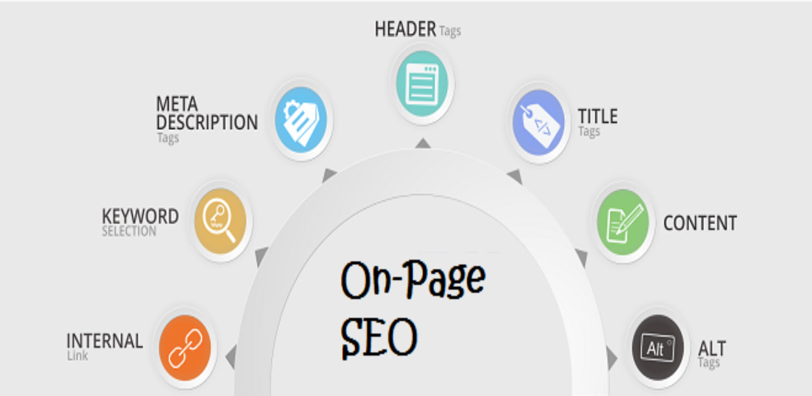
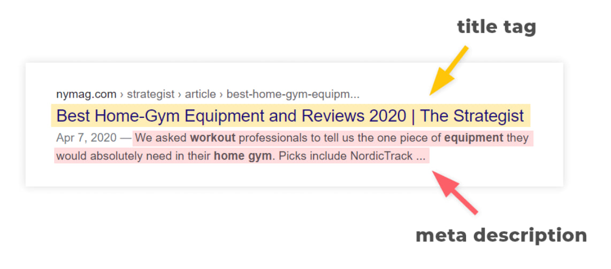
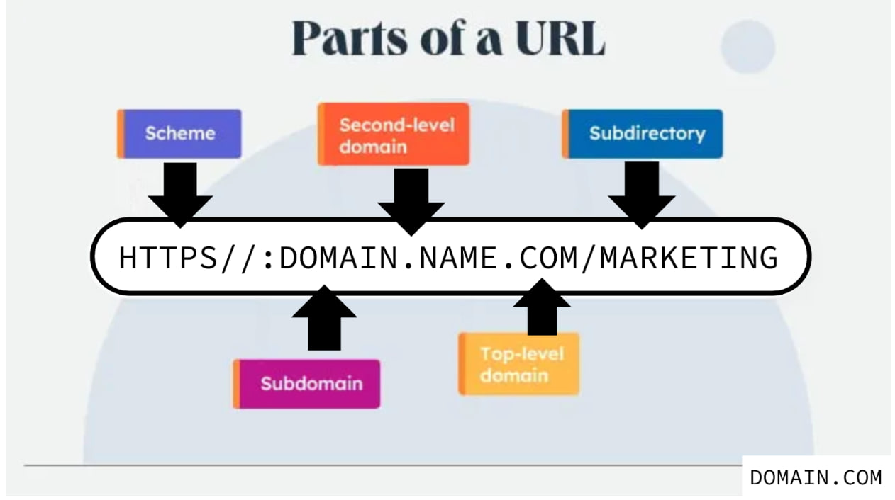
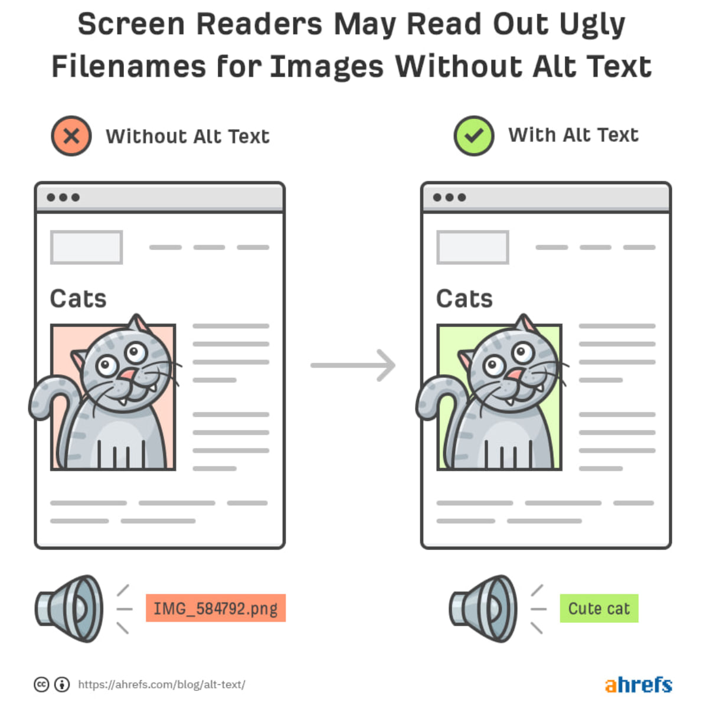
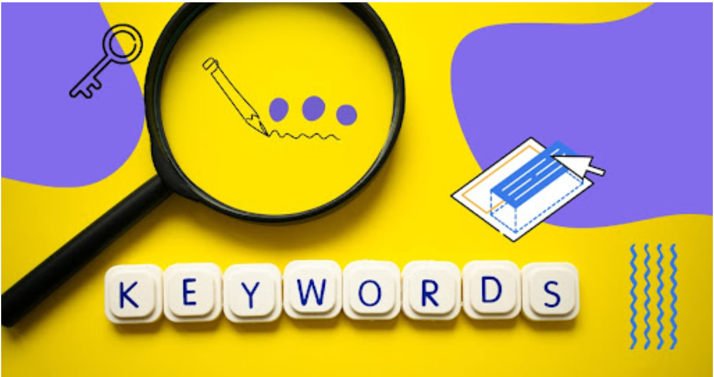
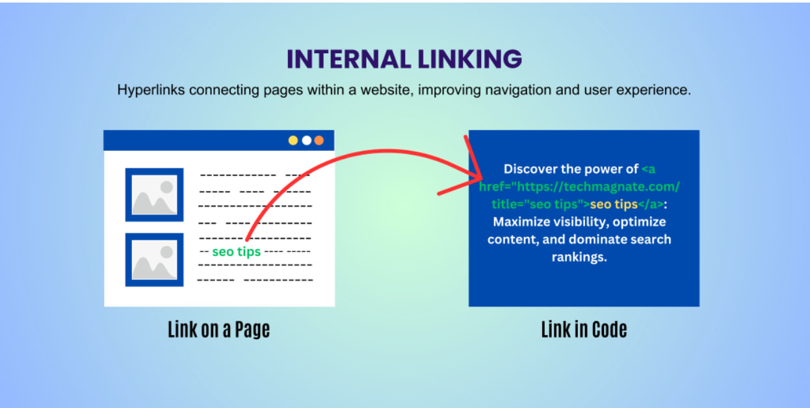
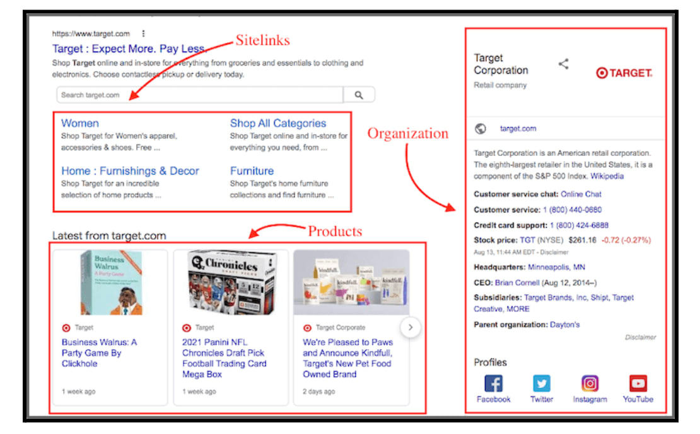

# What is On-Page SEO?
**On-Page SEO** (also known as On-Site SEO) refers to the optimization of individual web pages to improve their rankings in search engine results and drive organic traffic. It involves optimizing content, and website structure to make it more search engine-friendly. This process ensures that both search engines and users can easily understand and navigate a webpage, leading to higher visibility and engagement.




### **Why is On-Page SEO Important?**
#### **Improves Search Rankings**
Search engines like Google use complex algorithms to determine page rankings. By optimizing key on-page elements such as keywords, title tags, meta descriptions, and headings, search engines can better understand the relevance of your content, improving its chances of ranking higher in search results.

#### **Enhances User Experience (UX)**
User experience plays a crucial role in website performance. A well-optimized page with structured content, clear headings, and intuitive navigation improves readability and keeps visitors engaged. Google rewards sites that prioritize user experience by ranking them higher in search results.

#### **Increases Organic Traffic**
Higher rankings in search engine results lead to increased organic traffic. Unlike paid advertisements, organic traffic is cost-effective and sustainable, driving long-term growth and visibility for your website.

#### **Helps with Crawling & Indexing**
Search engines rely on crawlers to index web pages efficiently. Proper on-page optimization, including internal linking, clear URL structures, and optimized images, makes it easier for Google and other search engines to crawl and index your website's content effectively.

### **Key Elements of On-Page SEO Optimization**
#### **Title Tags & Meta Descriptions**

- Title tags should include primary keywords and remain within 60 characters.

- Meta descriptions should be compelling, informative, and within 155 characters.




#### **URL Structure**

- URLs should be short, descriptive, and include relevant keywords.
- Avoid special characters and unnecessary numbers to keep URLs clean and readable.




#### **Image Optimization**

- Use descriptive file names and alt text for images.
- Compress images to improve load times without sacrificing quality.




#### **Keyword Optimization**

- Use keywords naturally in headings, paragraphs, and meta tags.
- Avoid keyword stuffing, which can harm rankings.




#### **Internal & External Links**

- Internal links improve navigation and keep users engaged.
- External links to authoritative sources enhance credibility and SEO value.




#### **Schema Markup**


- Implement structured data (schema markup) to help search engines understand content better.
- Enhances search result features like rich snippets and knowledge panels.




```https://docs.google.com/document/d/1FchW3g_oYjyqwkhlI4fpyLkUNBd7mDLigs9-H2NUsoE/edit?tab=t.0#heading=h.gmke4zwra7dj```


