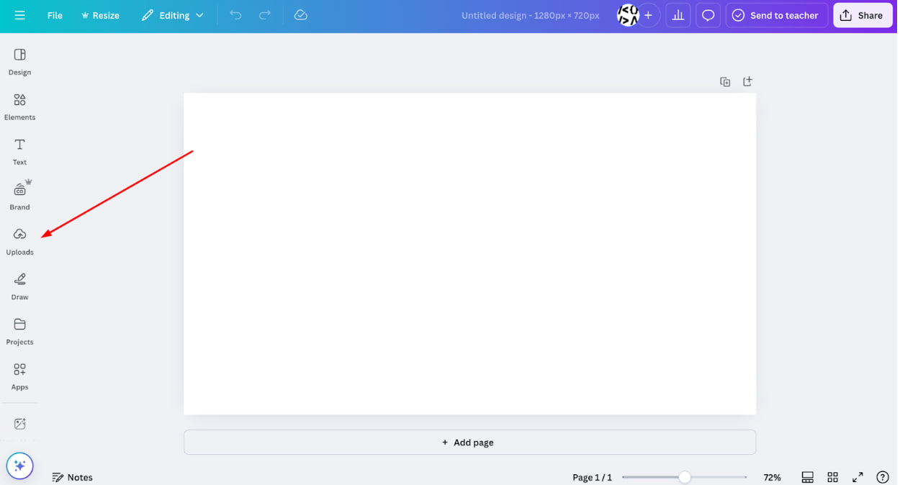
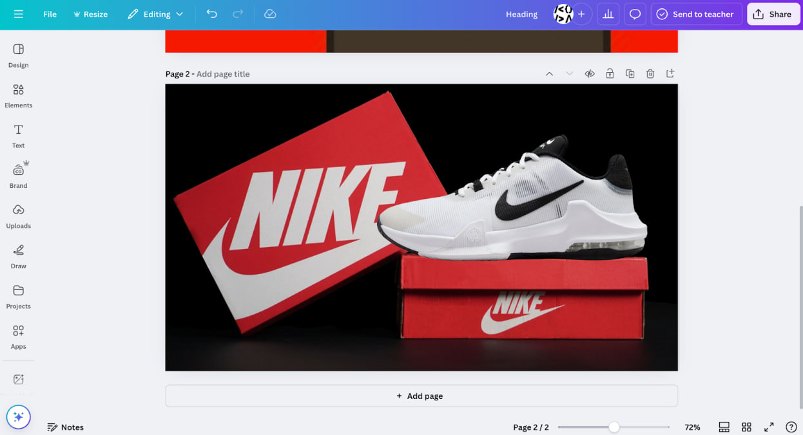
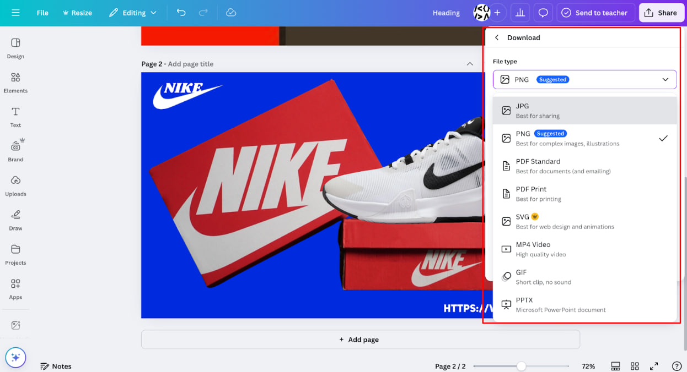

# Structure in canva

### **Step 1: Open Canva**
Go to [Canva.com](https://www.canva.com/) and log in or sign up.
Click "Create a design" or choose a template that fits your needs.

### **Step 2: Upload Your Image**
Click on "Uploads" in the left sidebar.
Select "Upload files" and choose the image from your device.
Drag the image onto your design canvas.

### **Step 3: Edit the Image**

**Resize & Crop** – Click on the image, drag the corners, or use the "Crop" tool.

**Adjust Colors & Brightness** – Click "Edit Image", then adjust brightness, contrast, and saturation.

**Apply Filters** – Choose from preset filters to enhance the image.

**Add Effects** – Use shadows, blur, or remove the background (Pro feature).

**Enhance with Elements** – Add stickers, icons, or overlays from the "Elements" tab.

**Insert Text** – Click "Text", then choose fonts, colors, and effects.

### **Step 4: Add Background or Layers (Optional)**
Click on "Background" to change the backdrop.
Add additional elements like shapes, frames, or illustrations for a creative touch.
Use the "Position" tool to arrange layers (bring forward or send backward).

.jpg)

### **Step 5: Save & Download Your Image**
Click "Share" in the top right corner.
Select "Download" and choose a file format (PNG, JPG, PDF, etc.).
Click "Download", and your edited image is ready!

		
