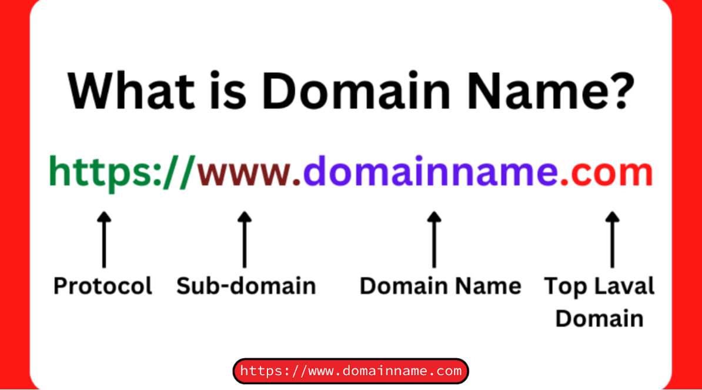
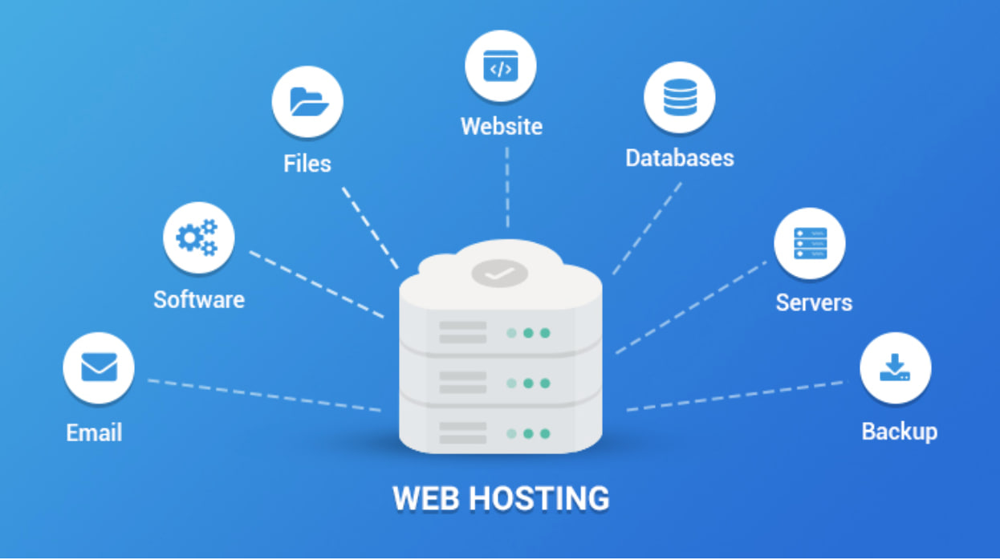
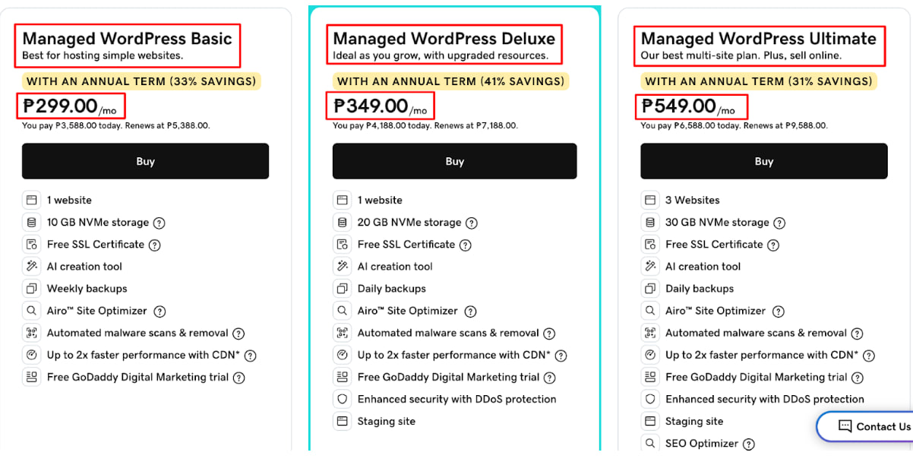
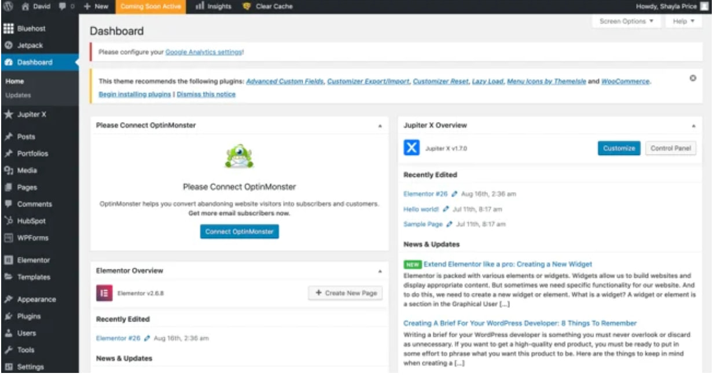
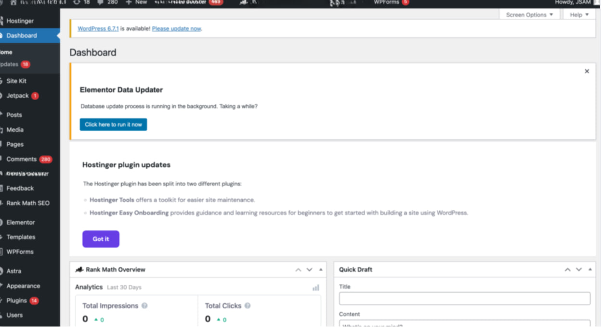
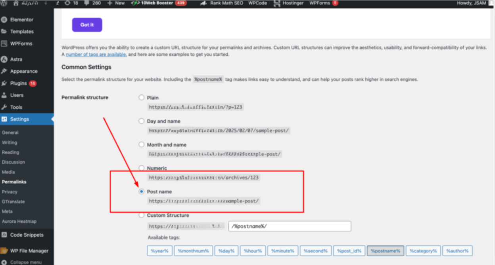
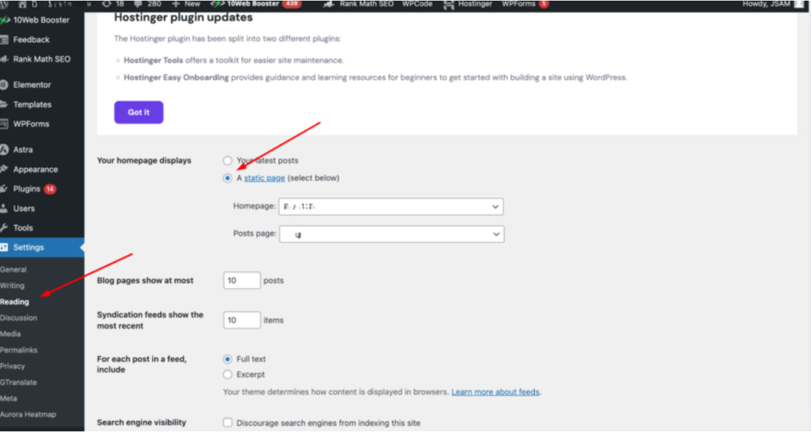
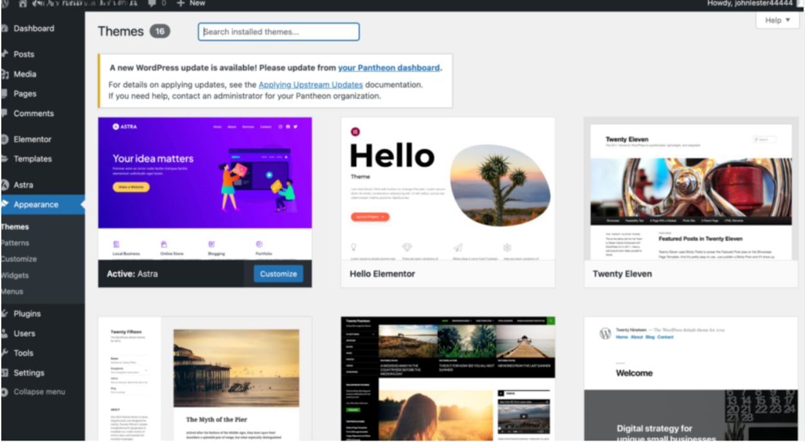
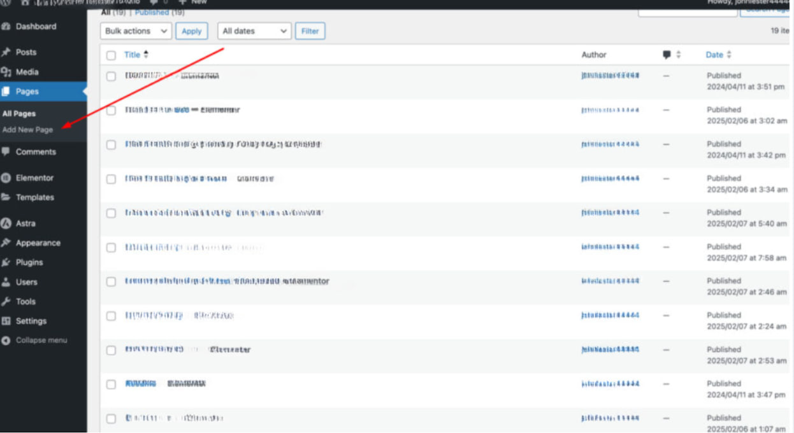

# URL Structure
## What is URL Structure?

A URL structure refers to how a website's web addresses (URLs) are organized and formatted. A well-optimized URL structure improves SEO, user experience, and website navigation.

### Why is URL Structure Important for SEO?

- **Improves Search Rankings** – Clean URLs help Google understand your page content.
- **Boosts Click-Through Rate (CTR)** – Short, readable URLs attract more clicks.
- **Enhances User Experience** – Visitors can easily navigate your site.

### How to Improve URL Structure

* **Readability**: URLs should be easy to read and understand for both users and search engines. Avoid using long strings of random numbers or characters.

Example: `www.example.com/healthy-breakfast-recipes`

* **Keywords**: Include relevant keywords in your URLs to improve search engine rankings and give users an idea of the page's content.

Example: `www.example.com/vegan-breakfast-ideas`

* **Hyphens vs. Underscores**: Use hyphens to separate words in URLs, as search engines recognize hyphens as word separators. Avoid using underscores.

Correct: `www.example.com/organic-cooking-tips`

Incorrect: `www.example.com/organic_cooking_tips`

* **Lowercase Letters**: Use lowercase letters in URLs to avoid potential issues with case sensitivity.

Correct: `www.example.com/gardening-tools`

Incorrect: `www.example.com/Gardening-Tools`

* **Avoid Special Characters**: Avoid using special characters like &, %, $, @, etc., as they can cause issues with browsers and search engines.

Correct: `www.example.com/guide-to-yoga`

Incorrect: `www.example.com/guide&to=yoga`

---

## **What is a Domain?**

A domain is the unique web address (URL) that identifies a website on the internet. It is what users type into a browser to access a website.

For example, `www.google.com` is the domain for Google.

### Components of a Domain Name

A domain consists of different parts:

- **Protocol**: `https://` (HyperText Transfer Protocol Secure) - Indicates a secure website
- **Subdomain**: `www.` (World Wide Web) - Optional, not always required
- **Domain Name**: `google` - Unique identifier
- **Top-Level Domain (TLD)**: `.com` - Also called domain extension

Example: `https://www.example.com`

- `example` = Domain name
- `.com` = TLD

### Top-Level Domains (TLDs)

Different TLDs indicate the type of website or its function:

- `.com` for commercial websites
- `.gov` for government websites
- `.org` for non-profit organizations
- `.store` for eCommerce businesses

### Where Domain Names Appear

A domain name is usually seen in the address bar of a web browser when visiting a website. It is part of a website's URL (Uniform Resource Locator).

---

## What is Hosting?

Hosting (Web Hosting) is a service that allows websites to be stored and accessed on the internet. It provides the necessary resources—such as servers, bandwidth, and storage space—to keep a website online and available to users.

### Real-Life Example of Web Hosting

Web hosting is like renting a space for your store in a shopping mall:

- **Web Hosting = The Store Space**  
  Just like a mall rents out physical space for shops, a web hosting provider (like Bluehost, GoDaddy, or SiteGround) rents out server space for your website.

- **Domain Name = Store Address**  
  Your website needs an address so people can find it (e.g., `www.myclothingstore.com`), just like a store has a physical address.

- **Website Files = Products & Store Design**  
  Your website's files (images, text, products) are like the clothing, shelves, and decorations inside your store.

- **Hosting Plan = Store Size & Features**  
  If you expect high traffic (many visitors), you need a bigger hosting plan, just like a busy store needs more space or staff.

## Things to Consider When Buying a Domain

Purchasing a domain is an essential step in building your online presence. Here are key factors to consider:

 **Choose a Memorable & Brandable Name**

   - Keep it short, simple, and easy to remember
   - Avoid numbers, hyphens, and confusing spellings
   - Make it unique to represent your brand
   - Example: Instead of `"best-shoes123.com"`, choose `"BestShoes.com"`

---

## What is WordPress?

WordPress is the most popular content management system (CMS) used to build and manage websites. It powers over 43% of all websites on the internet. WordPress allows users to create websites without coding, making it ideal for beginners and professionals.

### Key Features of WordPress

 **Easy Website Creation**

- No coding skills required – install & start building
   
- Drag-and-drop page builders

 **Fully Customizable**

- Thousands of themes for design customization
- Over 50,000+ plugins to add features (SEO, security, eCommerce, etc.)

 **SEO-Friendly**

Optimized for Google rankings
SEO plugins like Yoast SEO & Rank Math

 **Mobile & Speed Optimization**

Responsive mobile-friendly themes
Fast-loading websites with caching plugins

 **Supports All Types of Websites**

- Blogs
- Business Websites
- eCommerce Stores (WooCommerce)
- Portfolios
- Membership Sites Forums & more!

### Installing WordPress

Most hosting providers have 1-click WordPress installation:

1. Log in to your hosting account (Bluehost/SiteGround/Hostinger)
2. Find "Install WordPress" or "One-Click Install"
3. Select your domain name and click Install
4. Set up your WordPress username & password
5. After installation, your website will be live at: `yourwebsite.com/wp-admin` (to log in to WordPress)

### Initial WordPress Setup

* **Go to Admin site** `domain.com/wp-admin`

* **Set Up Permalinks**
	Navigate to: Settings > Permalink > Select "Post name"

* **Configure Reading Settings**  
   Go to: Settings > Reading > Select "Static page" (if you don't have a blog post, don't select this)

* **Install SEO Plugin**  
   Go to: Plugins >  Search for "Rank Math"

* **Choose a Theme**  
   Go to: Appearance > Themes > Add New > Search for "Astra"

* **Add Content Pages**  
   Navigate to Pages section to add and edit your content

