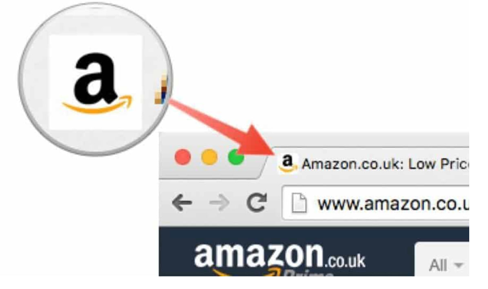
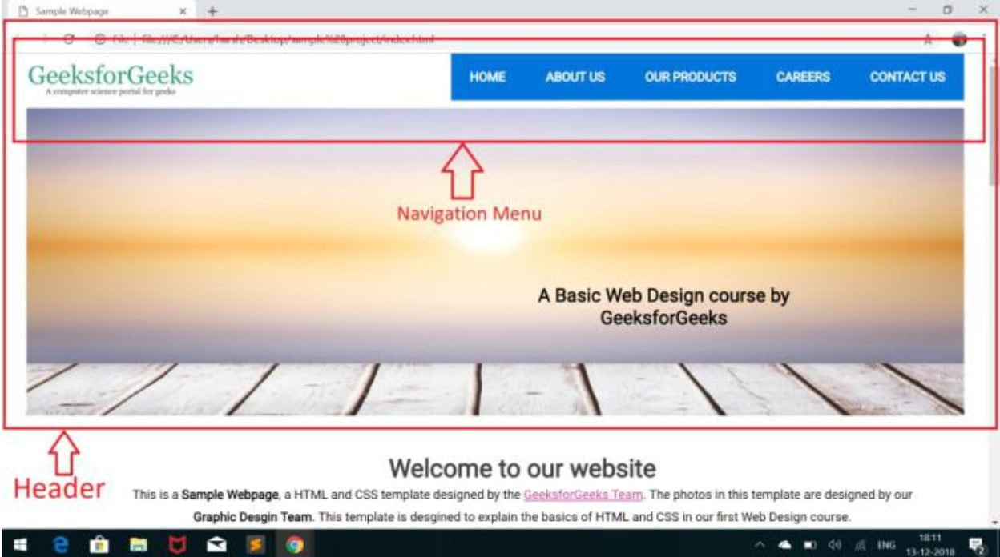
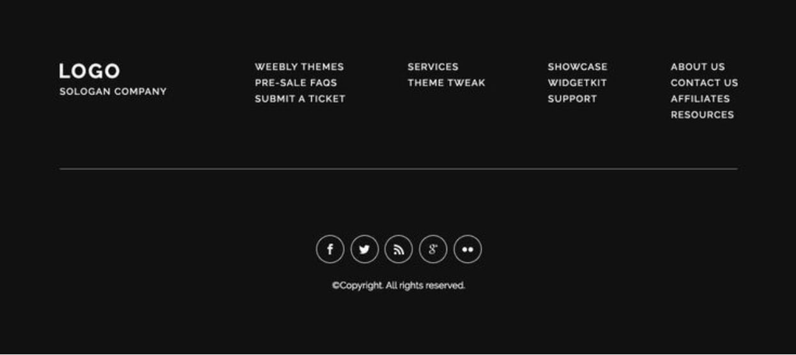
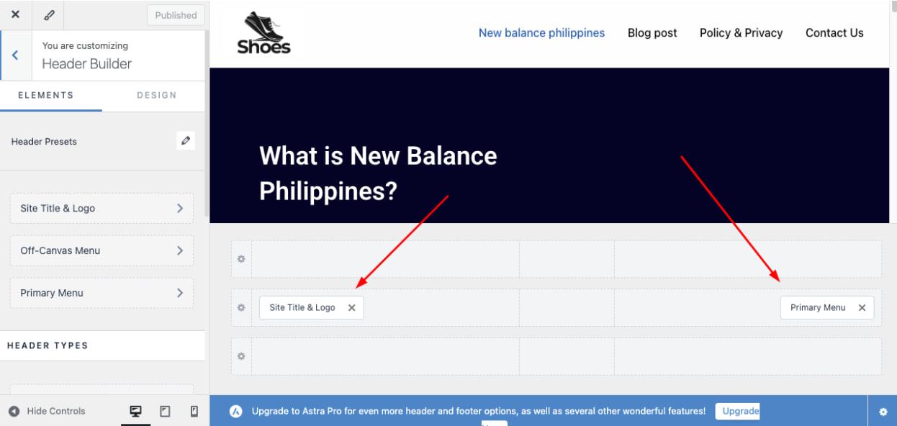
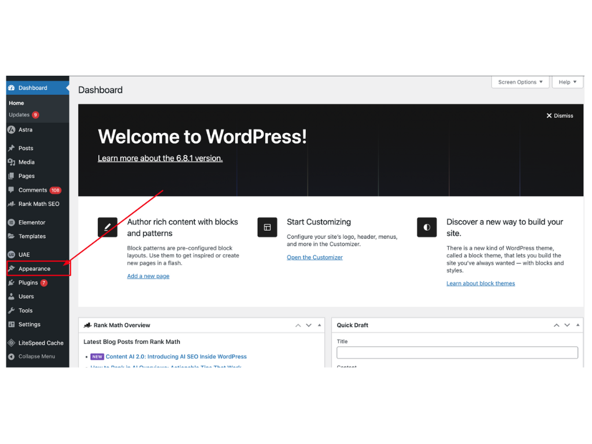
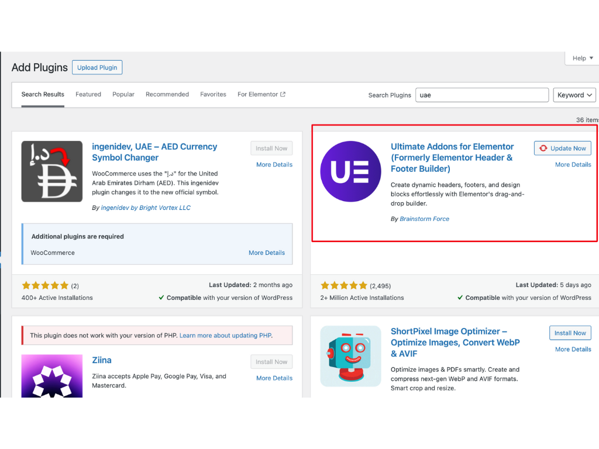

# Logo & Favicon

## **What is a Logo & Favicon?**

### Logo: Size (250x150)

A logo is a visual symbol that represents a brand, company, or website. It is usually placed in the website header and branding materials.

### Why is a Logo Important?

- Increases brand recognition and professionalism.
- Helps users identify your website easily.
- Builds trust and credibility.

### Favicon: Size (40x40)

A favicon is a small icon displayed in the browser tab, bookmarks, and search results. It helps users quickly recognize your website.

### Why is a Favicon Important?

- Improves website branding and visibility.
- Enhances user experience and recognition.
- Adds a professional touch to your website.

## **Header and Footer in SEO**

### What is a Header?

The header is the top section of a webpage, usually containing:

- Website logo & branding
- Navigation menu (Home, About, Services, Contact)
- Call-to-action buttons (Sign Up, Buy Now)
- Search bar (if applicable)

### Importance of a Website Header

The header is the top section of a website, usually containing the logo, navigation menu, and key links.

**Enhances Navigation**
* The header makes it easy for visitors to access important pages like Home, About, Contact, and Services.
* A well-structured menu improves user experience and reduces bounce rates.

### What is a Footer?

The footer is the bottom section of a webpage, often containing:

- Contact details (phone, email, address)
- Important links (Privacy Policy, Terms of Service, Sitemap)
- Social media links
- Newsletter signup
- Copyright information

### Importance of a Website Footer

The **footer** is the **bottom section** of a website, usually containing additional links, legal information, and contact details.

**Provides Important Information**
* Common footer elements include **contact details, privacy policy, terms & conditions, and social media links**.
* Ensures users can find legal and business-related info easily.

## Implementation in WordPress

### How to Set-up Header

**Go to Astra > Customize > Header Builder**

### How to Set-up Footer

**Go to appearance and click the customize**

**look for header builder and footer builder**

### Plugins that we use for Header and Footer
#### Ultimate add-ons for elementor

