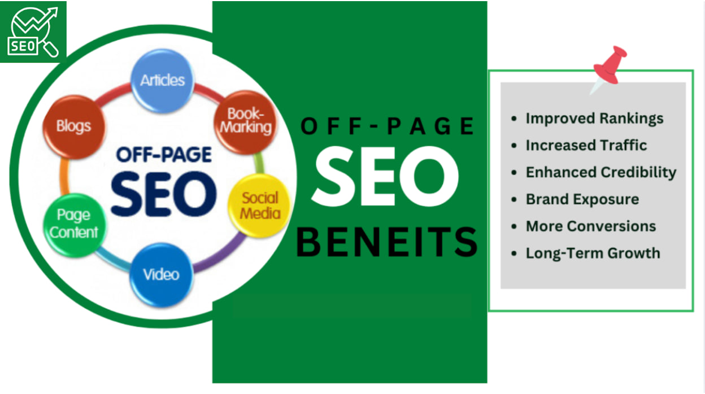
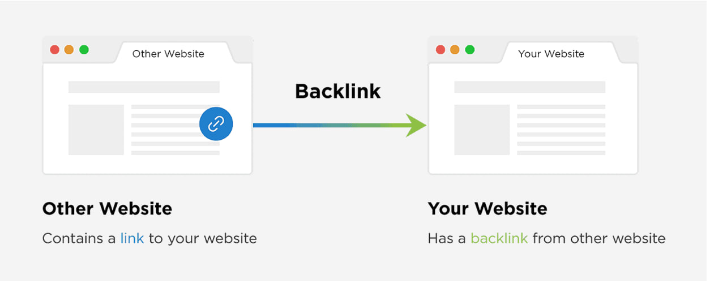
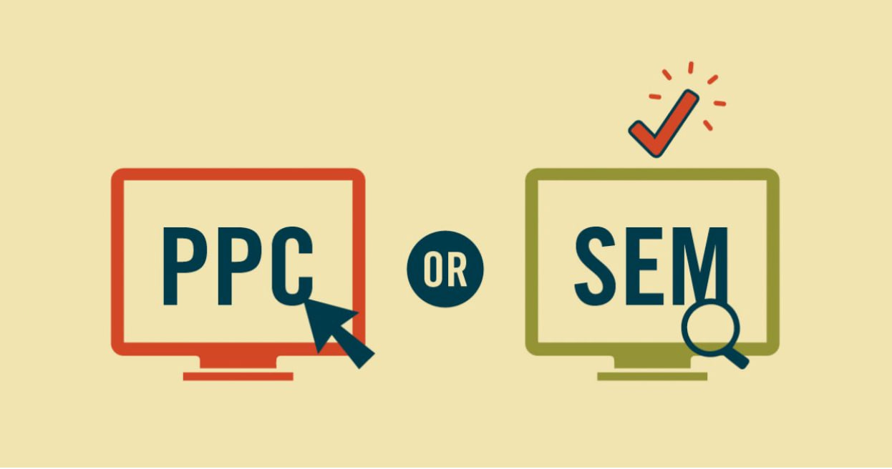

## 1. What is Off-Page SEO?

Off-Page SEO refers to all activities performed outside of your website to improve its search engine rankings and authority. It focuses on building trust, relevance, and credibility through external signals such as backlinks, social media engagement, and brand mentions.

While On-Page SEO involves optimizing elements within your website, Off-Page SEO leverages external factors to enhance your online presence.

### Key Components of Off-Page SEO:
- **Backlink building** – Acquiring quality links from authoritative websites
- **Social media signals** – Engagement on social media platforms that influence brand visibility
- **Influencer outreach** – Collaborating with influencers to promote content and gain credibility
- **Local SEO** – Optimizing for location-based searches and local citations
- **Brand mentions** – Increasing your website's reputation through unlinked brand references

## 2. Understanding Backlinks

### What is a Backlink?
A backlink, also known as an inbound link, is a hyperlink from one website to another. Search engines view backlinks as a vote of confidence, signaling that the linked-to content is valuable and authoritative.

### Types of Backlinks

Not all backlinks are good for your website. While backlinks are highly recommended for improving SEO rankings, there are reasons why some website owners don't want to create or allow backlinks on their site: to protect their SEO authority, prevent spam, monetize their platform, maintain strict editorial policies, or because they don't see backlinks as valuable for their traffic strategy.

#### 1. DoFollow Backlinks
- Passes link equity (ranking power) from the linking website to your site
- Hyperlink to a post, preferred for improving SEO rankings

**Example**: A Dofollow link is a hyperlink that passes SEO value to the linked website. For example, if a blog post links to another website.

#### 2. NoFollow Backlinks
- Do not pass SEO value but can still drive traffic
- Used for sponsored links, user-generated content, and forums
**Example**: A link to your site from a Facebook post or comments, Instagram bio, or Twitter

#### 3. Guest Post Backlinks
- Obtained through guest blogging on other websites with a link back to your site
- Guest post is direct to dofollow backlink, meaning when you contribute content to another website, you include a hyperlink to your own site within the article
- Search engines recognize it and pass SEO value to your website

#### 4. Directory Backlinks
- Listed in online business directories or citation websites

**Example**: Citation websites are online directories where businesses can list their Name, Address, and Phone Number (NAP)

- Directory backlinks can be either Dofollow or Nofollow, depending on how the directory website sets up its links
- Some business directories provide Dofollow backlinks, passing link equity (SEO value) to your website, which helps improve rankings

#### 5. Social Media Backlinks
- Links from social platforms like Facebook, Twitter, and Instagram

Social media marketing generates nofollow backlinks When you post a link on platforms like Facebook, Twitter, Instagram, or LinkedIn, these platforms automatically add a special tag to the link called:
 `rel="nofollow"` 

this tag tells search engines **NOT** to count that link as a ranking factor for SEO

**Why Do Social Media Sites Use Nofollow Tags?**

- **Prevent Spam** – If social media links passed SEO value, people would spam their links everywhere just to rank higher
- **Avoid Manipulation** – Without the nofollow tag, businesses might manipulate search rankings by excessively posting backlinks on social media

### Building a Strong Backlink Strategy for SEO

A successful backlink strategy requires:

- **Creating High-Quality Content** – Publish valuable, unique, and shareable content
- **Outreach & Relationship Building** – Network with bloggers, journalists, and influencers
- **Guest Post** – Write for reputable sites within your industry
- **Utilizing Business Directories** – Submit to trusted directories for relevant backlinks
- **Monitoring Competitor Backlinks** – Use SEO tools like Ahrefs or SEMrush to analyze competitor link profiles

## 3. Social Media Signals in SEO

Social media signals refer to interactions on social platforms (likes, shares, comments, etc.) that influence SEO. While they don't directly impact rankings, they help in:

### Increasing Content Visibility and Engagement
**How**: More Shares = More Exposure

- When users share your content, it reaches their followers and expands your audience

- Viral content gets exponential visibility as more people reshare it

**Example**: If a blog post about "Best SEO Strategies in 2024" gets 500 shares on Facebook and Twitter, it can reach thousands of new readers without paid promotion

### Driving Referral Traffic to Your Website
**How**: Sharing Links on Social Media

- When you share your website's link on platforms like Facebook, Twitter, LinkedIn, or Pinterest, it drives direct traffic from those platforms

- People who click on your shared post or bio link land on your website

**Example**: If you post an article on "Best SEO Practices in 2024" with a link to your blog, users who find it interesting click on the link and visit your site

### Boosting Brand Awareness and Credibility
**How**: Consistent Posting Builds Trust

- Regular, high-quality posts position your brand as an authority in your industry

- A consistent presence reassures customers that your brand is active and reliable

**Example**: A health blog regularly posts expert-backed wellness tips on Instagram → Followers see it often → Trust in the brand grows

## 4. Influencer Outreach in SEO

Influencer outreach involves collaborating with industry influencers to promote your content, product, or brand. Benefits include:
- Increased exposure through influencers' audience
- Higher engagement due to influencer trust
- Potential backlinks from influencer websites and blogs

## 5. Local SEO

Local SEO focuses on optimizing your online presence for local searches, helping businesses appear in geographically relevant results. Key elements include:

- **Google My Business (GMB) optimization** – Claim and optimize your GMB listing

- **Local citations** – Ensure business consistency across directories like Yelp and Yellow Pages

- **Customer reviews** – Encourage and manage online reviews

## 6. Why is Off-Page SEO Important?

- **Increases domain authority** – Helps search engines see your site as trustworthy
- **Boosts rankings** – Quality backlinks signal to Google that your content is valuable
- **Drives referral traffic** – Links from high-traffic sites bring visitors to your page
- **Enhances brand visibility** – More exposure through social media and mentions

## 7. Difference Between PPC and SEM

| Factor | PPC (Pay-Per-Click) | SEM (Search Engine Marketing) |
|--------|---------------------|------------------------------|
| Definition | A digital advertising model where advertisers pay for each click on their ads. | A broader strategy that includes both paid ads (PPC) and organic search optimization (SEO). |
| Scope | Only includes paid ads (Google Ads, Bing Ads, etc.). | Includes both PPC (paid ads) and SEO (organic search optimization). |
| Cost Structure | Advertisers pay for each click on their ads. | SEM includes both paid advertising (PPC) and the long-term investment in SEO (which is free but requires effort). |
| Visibility Speed | Immediate – once the ad is launched, it appears in search results. | SEO (part of SEM) takes time, while PPC provides instant visibility. |
| Example | Google Ads, Facebook Ads, Bing Ads, Display Ads. | PPC + SEO efforts (e.g., ranking organically and running paid search ads). |

### Key Takeaways:
- PPC is a part of SEM
- SEM is a mix of PPC (paid search ads) and SEO (organic ranking efforts)
- If you're focusing only on paid ads, you're doing PPC
- If you're working on both SEO & PPC, you're doing SEM

