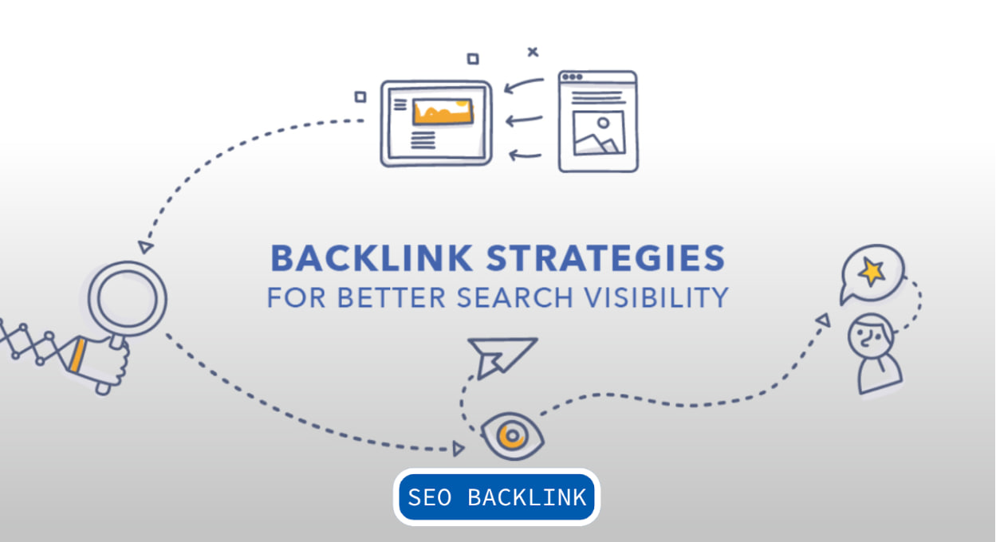

# Building a Strong Backlink Strategy for SEO

## Introduction
A strong backlink strategy is essential for improving your website's authority, rankings, and organic traffic. High-quality backlinks act as "votes of confidence" from other websites, signaling to search engines that your content is valuable. However, not all backlinks are created equal, and a well-planned approach ensures you attract authoritative, relevant, and beneficial links.

## Step 1: Understand the Types of Backlinks

Not all backlinks hold the same value. It is essential to focus on acquiring high-quality backlinks while avoiding low-quality or spammy links that can harm your rankings.

### High-Authority Backlinks
These backlinks come from well-established and authoritative websites such as **Forbes, HubSpot, government sites (.gov), and educational institutions (.edu)**. Google values these links highly because they are difficult to obtain and reflect credibility.

### Contextual Backlinks
These are links placed **within relevant content** on another website rather than in a sidebar, footer, or unrelated section. Contextual backlinks provide higher SEO value because they appear naturally in content that discusses relevant topics.

### Dofollow vs. Nofollow Links
- **Dofollow Links**: These links pass SEO value (link juice) to your website, helping improve rankings.
- **Nofollow Links**: These do not pass SEO value but can still bring traffic and brand exposure.

### Avoid Low-Quality Links
Links from **spammy, irrelevant, or low-authority** sites can negatively impact your rankings. Google's algorithm penalizes websites with manipulative or unnatural link-building practices, so focus on quality over quantity.

## Step 2: Research & Analyze Competitor Backlinks

A great way to improve your backlink strategy is by analyzing where your competitors get their backlinks. This helps you identify high-authority websites that might be open to linking to your content.

### How to Find Competitor Backlinks:
1. Use tools like **Ahrefs, SEMrush, Moz, or Ubersuggest** to analyze competitors' backlink profiles.
2. Identify **high-authority websites** linking to your competitors.
3. Look for patterns: Are they getting backlinks from **guest posts, resource pages, interviews, or content mentions?**

### Actionable Steps:
- **Create Better Content**: If your competitors have backlinks to a similar resource, make a better, more updated version and pitch it to the same websites.
- **Outreach for Guest Posts**: Reach out to the sites linking to your competitors and offer to write a high-quality guest post.
- **Leverage Unlinked Mentions**: If websites mention your brand but don't link to you, request that they add a backlink for you.

## Step 3: Guest Blogging (High-Quality Content Contribution)

Guest blogging is one of the most effective ways to build **high-quality and authoritative backlinks.**

### Why Do You Have to Pay for Guest Blogging?
- **Editorial and Quality Control**: Websites spend time reviewing, editing, and formatting guest posts to match their quality standards.
- **Monetization**: High-traffic websites use guest posting as a revenue stream. They charge fees for brands or individuals looking for backlinks.
- **SEO Value**: A backlink from a high-authority website can significantly boost your rankings, so many site owners charge for the benefit.

### Steps to Successful Guest Blogging:

#### Find Reputable Websites in Your Industry
Use Google search queries like:
- "Write for us + [your industry]"
- "Guest post guidelines + [your niche]"
- "Submit a guest post + [your topic]"

#### Consider Your Guest Posting Options

**Buying a Guest Post (With Content Provided by the Website Owner)**

- If the website owner writes the content themselves and publishes it on their site, this usually requires full payment.

**Create Your Own Content**

- Write the article yourself and ask the website owner to post it to their website
- If you write the article yourself, the cost is usually discounted
- Placement on their homepage typically requires higher payment

#### Effective Outreach

- Personalize your outreach email
- Provide 3-5 content ideas that align with their audience
- Highlight your expertise and past published work

#### Write High-Quality Content with Natural Backlinks

- Include valuable insights, research, statistics, and examples
- Naturally link back to your site within the content
- Ensure your guest post aligns with the website's content style and tone

## Step 4: Build Relationships for Natural Backlinks

Engaging with influencers, bloggers, and authoritative site owners in your industry increases your chances of earning natural backlinks.

### Relationship-Building Strategies:
- **Engage with Industry Leaders**: Comment on their blogs, share their content, and build rapport before asking for a backlink.
- **Join Industry Forums & Communities**: Provide valuable insights on platforms like Reddit, Quora, and niche forums to establish authority and gain backlinks.
- **Use Social Media to Amplify Content**: Sharing your content on LinkedIn, Twitter, and Facebook increases visibility, leading to natural backlinks from content curators.

## Step 5: Leverage Broken Link Building

This technique involves finding broken (dead) links on authoritative sites and offering your content as a replacement.

### How to Do Broken Link Building:
1. **Find Broken Links**: Use Ahrefs' Broken Backlinks tool or install the Check My Links Chrome extension.
2. **Create Better Content**: If the broken link was referencing outdated content, create a more updated version.
3. **Reach Out**: Contact the website owner and suggest replacing the broken link with your updated resource.

