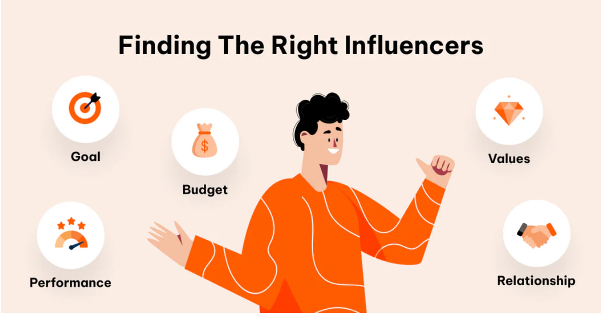

# Influencer Outreach in SEO


## What is Influencer Outreach in SEO?

**Influencer outreach** is the process of connecting with industry influencers, bloggers, and content creators to promote your brand, content, or website. This can involve **guest posts, collaborations, sponsored content, or social media mentions** to increase visibility and drive traffic.


## Why is Influencer Outreach Important for SEO?

### High-Quality Backlinks
- Influencers often have high-authority websites
- When they link to your content, it boosts your **domain authority (DA)** and improves rankings
- Quality backlinks from reputable sources are a critical ranking factor

### Increased Website Traffic
- Influencers have large, engaged audiences
- A mention from them can **drive significant referral traffic** to your website
- Higher traffic signals to search engines that your site is valuable

### Brand Awareness & Credibility
- Being featured by a respected influencer **builds trust** and positions your brand as an industry leader
- Enhanced credibility can lead to more organic mentions and links

### Content Amplification
- Influencers can **share your content** on their platforms, increasing **social signals** and engagement
- Wider content distribution increases the chances of earning more backlinks

### Boost Social Media Signals
- Likes, shares, and comments from influencers improve **social proof**, which can indirectly impact SEO
- Increased engagement extends the life and reach of your content

Influencer outreach is a powerful SEO strategy that helps **increase backlinks, website traffic, and brand visibility**. By partnering with the right influencers, you can improve your **search rankings and online presence** effectively.

## How to Do Influencer Outreach: Step-by-Step Guide

Influencer outreach is a strategic process that requires planning, research, and personalization. Follow these steps to create successful influencer partnerships.

### Step 1: Define Your Goals


Before reaching out, determine your specific objective:

- **Brand awareness**
- **Product promotion**
- **Content collaboration**
- **Driving sales/traffic**

Clear goals will help you identify the right influencers and create appropriate partnership proposals.

### Step 2: Find the Right Influencers




Look for influencers who match your **brand, audience, and niche**.

**Platforms to Find Influencers:**

- Instagram
- YouTube
- TikTok
- Twitter
- LinkedIn
- Blogs

**Types of Influencers:**

- **Mega influencers** (1M+ followers) – Celebrities, costly
- **Macro influencers** (100K – 1M followers) – High engagement
- **Micro influencers** (10K – 100K followers) – Niche-focused, affordable
- **Nano influencers** (1K – 10K followers) – High trust, budget-friendly

**Tools to Find Influencers:**

- **Free:** Google, Instagram Search, YouTube Search, Twitter Search
- **Paid:** BuzzSumo, Upfluence, HypeAuditor, Aspire

### Step 3: Research & Personalize

**Before reaching out:**

- Follow their content, engage (like, comment, share)
- Analyze their engagement rate (comments, likes, shares)
- Ensure their audience aligns with your target market
- Review their past collaborations and content style
- Identify mutual connections or interests


Proper research allows you to personalize your approach and demonstrate genuine interest in their work.

### Step 4: Contact the Influencer

Reach out via **Email, DMs, or Influencer Platforms.**


**Sample Outreach Email:**

**Subject:** Collaboration Opportunity – [Brand Name] x [Influencer Name]

```
Hi [Influencer's Name],

I love your content, especially your recent post on [mention a specific post]. Your authenticity and engagement with your audience are inspiring!

I'm [Your Name] from [Your Brand]. We'd love to collaborate with you on [campaign details, e.g., product review, sponsored post, giveaway]. We believe your audience would love our [product/service].

Would you be open to discussing a potential collaboration? Let me know your thoughts, and I'd be happy to share more details!

Looking forward to hearing from you.

Best,
[Your Name]
[Your Company]
[Your Contact Info]
```

### Step 5: Negotiate & Set Terms

**Discuss:**

- Type of content (post, story, reel, video, blog)
- Deliverables & timeline
- Compensation (paid, affiliate, free product, commission)
- Tracking (discount codes, UTM links)
- Content approval process
- Usage rights and exclusivity terms


