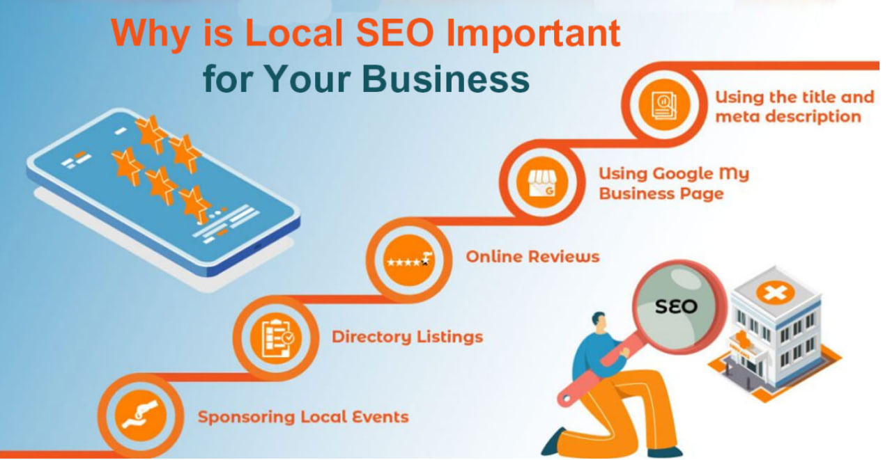
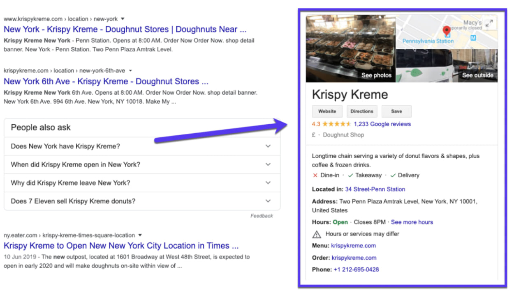

# Local SEO: Optimizing for Local Search

## Introduction
For businesses that serve specific geographic areas, Local SEO is critical for reaching nearby customers. This specialized form of search engine optimization helps your business appear in location-based searches, map listings, and the coveted Local Pack results, directly connecting you with customers in your area.

## What is Local SEO?

**Local SEO (Local Search Engine Optimization)** is the process of optimizing a business's online presence to improve visibility in **local search results** on Google and other search engines. It helps businesses attract nearby customers searching for services or products.

Local SEO focuses specifically on searches with local intent, such as "restaurants near me" or "plumber in [city name]," and aims to position your business prominently in these results.

## Why is Local SEO Important?

### Higher Visibility in Local Searches
- Helps businesses appear in **Google's "Local Pack"** (the top 3 business listings in local searches)
- Increases chances of appearing in Google Maps results
- Enhances prominence in "near me" searches

### Increased Foot Traffic & Sales
- 46% of all Google searches have **local intent** (e.g., "coffee shop near me")
- Local searches often have higher conversion rates
- Many local searchers visit a store within 24 hours of their search

### Boosts Trust & Credibility
- Positive **Google reviews** improve reputation and encourage conversions
- Complete business listings with accurate information build customer confidence
- Photos and virtual tours help customers feel familiar with your business before visiting

### Better Mobile Search Performance
- Since most local searches happen on mobile devices, **local SEO ensures your business is found**
- Location-based mobile searches are growing year over year
- Mobile users often make quick decisions based on local search results

## How to Set Up Google Business Profile (Formerly Google My Business)

Google Business Profile is the cornerstone of effective Local SEO. Here's how to create and optimize your profile:

### Method 1: Direct Setup
1. Sign in to a Google account
2. Go to [Google Business Profile](https://www.google.com/intl/en_us/business/)
3. Enter your business name
4. Choose a business category
5. Add your business address
6. Add your phone number and website
7. Verify your listing (usually via mail, phone, or email)

### Method 2: Maps Setup
1. Open [Google Maps](https://maps.google.com/)
2. Search for your business name
3. Click the business name
4. Click "Claim this business"
5. Select a verification option

You can manage your profile through the Google Business Profile Manager or at google.com/business.

### Optimization Tips for Google Business Profile
**To improve your local ranking, you should:**

   * Verify your business locations
   * Update your business hours (especially during holidays)
   * Respond to reviews (both positive and negative)
   * Add high-quality photos to your profile

**To qualify for a Business Profile, your business must make in-person contact with customers during its stated hours**

Example of Google Business Profile:

You can also watch this video to learn how to set up a Google Business Profile:

<iframe width="560" height="315" src="https://www.youtube.com/embed/5bO2j9c88sM?si=Vk8ii7s5un-Z8PZi&amp;start=199" title="YouTube video player" frameborder="0" allow="accelerometer; autoplay; clipboard-write; encrypted-media; gyroscope; picture-in-picture; web-share" referrerpolicy="strict-origin-when-cross-origin" allowfullscreen></iframe>

## Key Local SEO Strategies Beyond Google Business Profile

### NAP Consistency
- Ensure your Name, Address, and Phone number are identical across all online platforms
- Update all directory listings to match your Google Business Profile information
- Fix any inconsistencies in business information across the web

### Local Keywords
- Include city or regional terms in your website's title tags, meta descriptions, and content
- Create location-specific pages if you serve multiple areas
- Use natural language that includes geographic terms

### Local Link Building
- Get listed in local business directories
- Join local chambers of commerce and business associations
- Sponsor local events and request a backlink

### Local Content Creation
- Create content about local events or news
- Develop guides specific to your local area
- Share local success stories and case studies

### Reviews Management
- Actively request reviews from satisfied customers
- Respond promptly to all reviews, especially negative ones
- Showcase positive reviews on your website

## Timing Considerations for New Businesses

If you're currently working on SEO for a website that isn't your future business but plan to use the same strategies, domain, or content for your future business, it might not be a good idea to fully implement it now.

**Why?**

* If you heavily optimize a site now and later change its purpose, branding, or content, search engines may take time to re-crawl and re-rank the new version
* If your current SEO efforts are linked to a different industry or niche, switching later could confuse search engines, affecting rankings
* Building authority for one purpose and then changing direction can result in a temporary ranking drop

