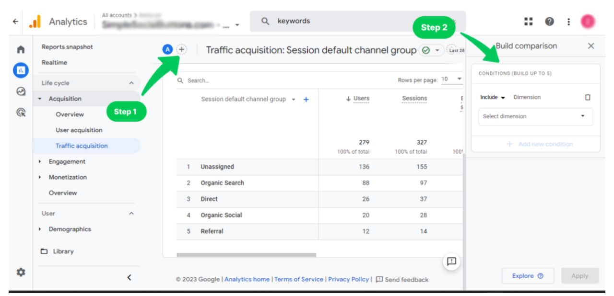
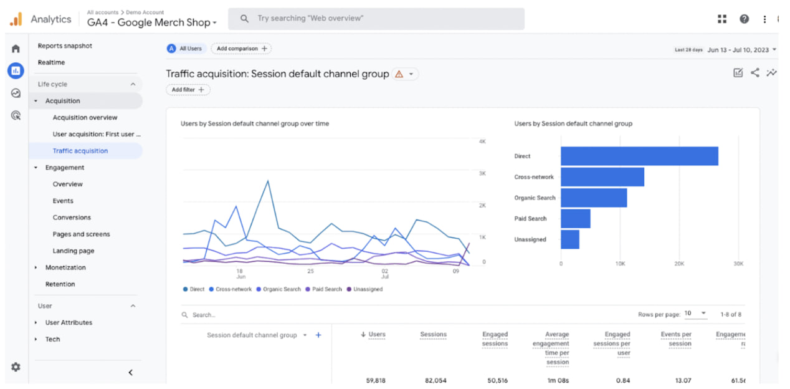
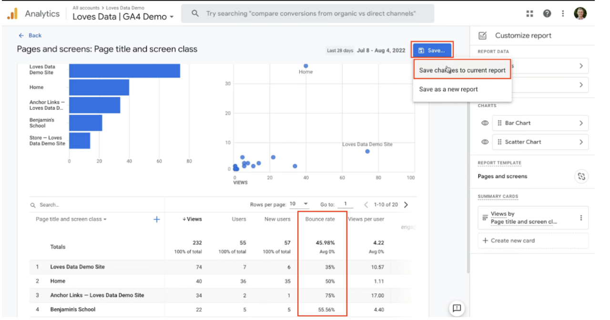
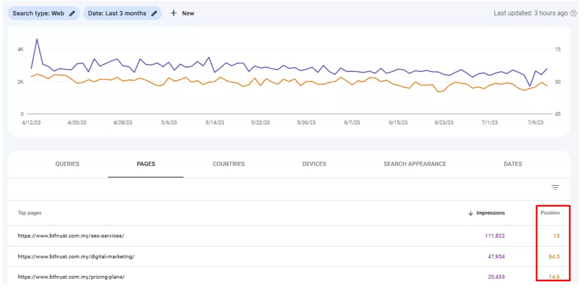

# Key Metrics to Track for Website Performance and SEO Success

Tracking the right metrics is essential for understanding how well your website is performing and identifying areas for improvement. Here are five key performance indicators (KPIs) that can help you optimize your site for better user experience, engagement, and conversions.

## 1. Organic Traffic

Organic traffic refers to the number of visitors who land on your website through search engines like Google, Bing, and Yahoo, without paid advertisements. It is a key indicator of your SEO success and shows how well your content ranks for relevant search queries.

### Why we need to track the Organic traffic:

- Because it helps you measure your SEO performance, understand how users find your site, identify trends, and optimize content for better rankings.

### Why It Matters:
- A higher volume of organic traffic suggests strong search visibility and effective keyword targeting.
- It helps measure the impact of your SEO and content marketing efforts.
- More organic visitors can lead to increased brand awareness and conversions.

### How to Track:
- Use Google Analytics (Acquisition > Overview > Organic Search) to monitor organic visitor trends.
- Check Google Search Console for keyword performance and search impressions.

## 2. Average Session Duration

This metric measures the average time a visitor spends on your site during a single session. A longer session duration often indicates engaging content and a positive user experience.

### Why we need to check Average session duration

- It helps measure how long visitors stay on your website, indicating how engaging and valuable your content is. A longer session duration suggests users are finding relevant information, exploring multiple pages, and engaging with your site.

### Why It Matters:
- A longer session duration suggests strong user engagement and content effectiveness.
- It helps identify pages that keep visitors interested versus those that lead to quick exits.
- It can contribute to better SEO rankings, as Google considers time on site a quality signal.

### How to Improve:
- Go to Understand Web> Overview> Average engagement
- Create compelling, high-quality content that keeps users engaged.
- Use multimedia elements like videos, infographics.
- Improve site navigation to encourage visitors to explore more pages.

## 3. Bounce Rate

Bounce rate is the percentage of visitors who leave your website after viewing only one page without interacting further. A high bounce rate may indicate issues with content relevance, user experience, or page load speed.

### Why we need to check bounce rate:
- You need to check the bounce rate because it helps measure how engaging and relevant your website content is to visitors. A high bounce rate may indicate that users are leaving quickly without interacting, which could mean poor content quality, slow page speed, unclear navigation, or irrelevant search intent.

### Why It Matters:
- A lower bounce rate suggests that visitors are engaging with multiple pages, increasing the chances of conversion.
- A high bounce rate may signal poor content quality, slow loading times, or unappealing design.

### How to Improve:
- Ensure fast page load speed by optimizing images and scripts.
- Provide engaging, relevant content that aligns with user intent.
- Use internal linking to guide visitors to other valuable pages.

## 4. Conversion Rate

The conversion rate measures the percentage of visitors who complete a desired action, such as signing up for a newsletter, making a purchase, filling out a contact form, or downloading a resource.

### Why We need to Check Conversion rate
- Tracking Conversion Rate helps measure how effectively your website turns visitors into customers, subscribers, or leads. A high conversion rate indicates that your content, design, and calls-to-action (CTAs) are working well.

### Why It Matters:
- A high conversion rate means your website is effectively persuading visitors to take action.
- It directly impacts your sales, lead generation, and overall business success.
- Low conversion rates can indicate user experience issues or an unclear call-to-action (CTA).

### How to Improve:
- Optimize landing pages with clear, compelling CTAs.
- A/B test different page elements (buttons, headlines, forms) to find what works best.

## 5. Keyword Rankings

Keyword rankings track how well your website ranks for specific search terms on search engine results pages (SERPs). Higher rankings increase visibility and bring more organic traffic to your site.

### Why we need to check keywords ranking
- Tracking keyword rankings helps you understand how well your website is performing in search engine results. It allows you to see which keywords drive traffic, identify opportunities for improvement, and adjust your SEO strategy.

### Why It Matters:
- Improved keyword rankings mean greater chances of attracting potential customers.
- Monitoring rankings helps you adjust your SEO strategy to stay competitive.
- Keyword performance shows which topics and content formats work best.

### How to Track & Improve:
- Use Google Search Console, SEMrush, or Ahrefs to track rankings.
- Optimize content for target keywords while maintaining natural readability.
- Regularly update old content to keep it relevant and fresh.