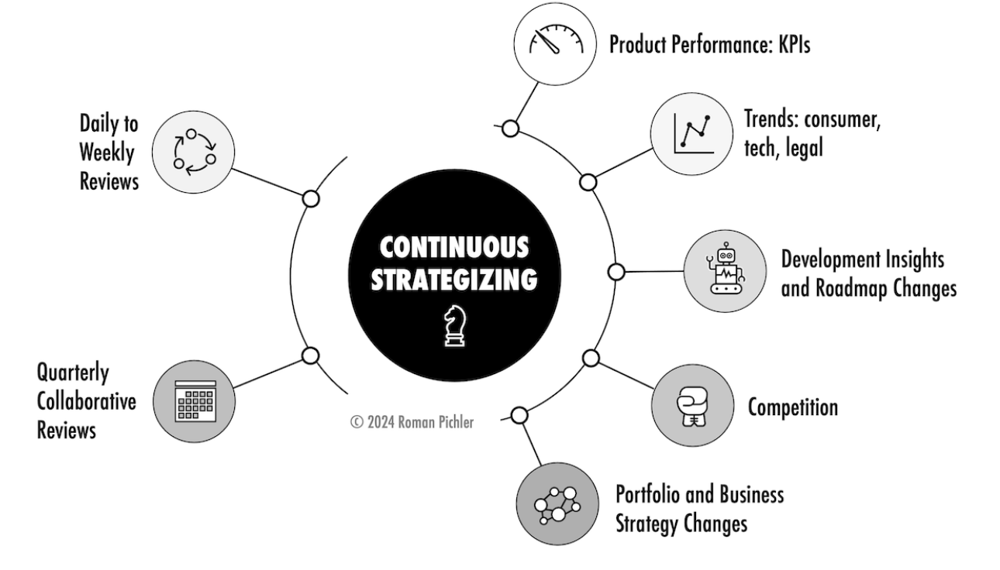
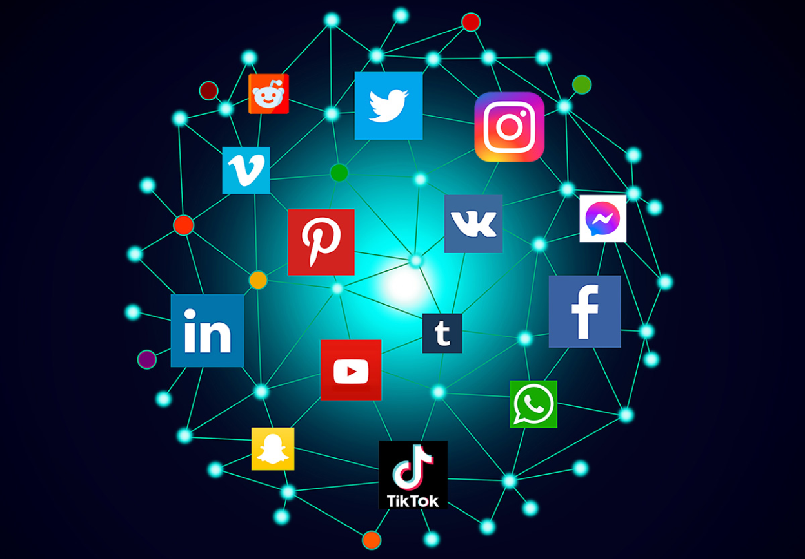

# Continuous Promotion Strategies

Promoting your content consistently is essential for maintaining visibility, driving traffic, and improving engagement. A well-executed promotional strategy ensures your brand remains relevant and continuously attracts new audiences. Here's how to do it effectively:

## Social Media Marketing

Social media platforms are powerful tools for increasing brand awareness, driving traffic, and engaging with your audience.

### Platform Selection
Choose the right platforms based on your target audience (e.g., LinkedIn for B2B, Instagram for visuals, Twitter for real-time updates).

### Content Sharing
Regularly post blog updates, product launches, behind-the-scenes content, and industry insights.

### Engagement Strategies
Respond to comments, participate in discussions, and use interactive content like polls and Q&A sessions.

### Hashtags & Trends
Leverage relevant hashtags and trending topics to increase discoverability.

### Social Media Ads
Run targeted campaigns to reach new potential customers and retarget website visitors.

**Example:** A fitness blog can share workout tips on Instagram Reels and Twitter threads to engage its audience and drive traffic to its website.

## Email Marketing

Email marketing is a cost-effective way to nurture leads, maintain relationships, and drive repeat visitors to your website.

### Build an Email List
Use lead magnets like free eBooks, discount codes, or exclusive content to encourage sign-ups.

**Example:** "Sign up & get 15% OFF your first order!"

### Segment Your Audience
Group subscribers based on interests, behavior, or engagement level to send personalized content.

### Send Engaging Newsletters
Share blog updates, new product launches, upcoming events, and special promotions.

### Use Strong CTAs
Ensure each email encourages an action (e.g., "Read More," "Shop Now," "Sign Up for a Webinar").

### Automated Drip Campaigns
Set up automated email sequences to nurture leads and guide them through the sales funnel.

**Example:** An e-commerce store selling handmade candles can send an email campaign featuring "Top 5 Fall Scents," linking to its latest products.

## Content Marketing

Creating and publishing high-quality content consistently helps establish your authority, attract new audiences, and retain existing ones.

### Blog Posts & Articles
Write in-depth, valuable content on industry trends, how-to guides, and case studies.

### Video Content
Create tutorials, product demos, and behind-the-scenes clips to engage visual learners.

### Infographics & Visuals
Design shareable infographics that summarize key data points and insights.

### Guest Posting
Write guest articles for high-authority websites to increase brand exposure and earn backlinks.

### Repurpose Content
Convert blog posts into videos, podcasts, or social media carousels to maximize reach.

**Example:** A travel blog can create a detailed "Ultimate Guide to Budget Travel in 2024," then break it into smaller social media posts, an email campaign, and a YouTube video.